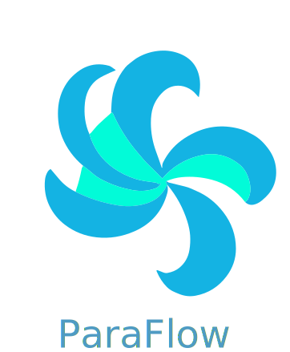

<p align="center">
    
</p>

<p align="center">the open source parametric flow passage generator</p>

<p align="center">
    <a href="https://discord.gg/H7qRauGkQ6">
        
    </a>
    <a href="https://www.patreon.com/turbodesigner">
        
    </a>
</p>


# About
ParaFlow is a declarative tool that parametrically generates turbomachinery flow passages with B-splines such as diffusers and nozzles. The purpose is to generate passages from different parameters during fluid simulation optimizations.


# Install
```
pip install git+https://github.com/Turbodesigner/paraflow.git#egg=paraflow
```

# Example

## Passage
Rocket Nozzle Passage
```python
from paraflow import SymmetricPassage
import numpy as np

passage = SymmetricPassage(
    inlet_radius=0.1,
    area_ratio=3.0,
    axial_length=1,
    contour_props=[0.25, 0.25, 0.5, 0.75],
    contour_angles=np.radians([-15.0, -5.0, 15.0, 15.0]).tolist()
)
passage.visualize("Bell Nozzle")
```


## Simulation
Rocket Nozzle Simulation Example
[simulation.ipynb](examples/simulation.ipynb)


# Devlopement Setup
```
git clone https://github.com/Turbodesigner/paraflow.git
cd paraflow
pip install -r requirements_dev.txt
```
